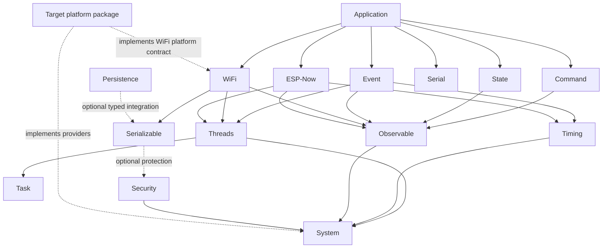

# Architecture

ESPressio 1.0.0 is organized around dependency inversion and domain ownership.

The diagram is intentionally conceptual: optional integrations are omitted where showing every edge would obscure the architectural direction.

## Layer 1 — portable runtime capabilities

[ESPressio System](https://github.com/ESPressio-Development-Platform/ESPressio-System/wiki/Home) defines platform-neutral memory, execution, synchronization, queue, clock and GPIO contracts. Target-specific SDK types do not belong above this boundary.

## Layer 2 — reusable foundations

Units provides physical type safety. Observable provides synchronous one-to-many notification. Serializable provides representation-neutral schemas. Task and Threads provide execution semantics above System. Timing provides clocks and discipline above System clock capabilities.

## Layer 3 — domain semantics

Command, Event and State represent different meanings rather than different transport encodings. Persistence and Security provide orthogonal storage/protection concerns.

## Layer 4 — transports and operator surfaces

WiFi owns WiFi lifecycle, ESP-Now owns ESP-NOW transport semantics, and Serial owns operator/diagnostic semantics. Concrete target implementations remain below portable contracts.

## Provider rule

Portable libraries define semantic contracts; target/platform packages implement them. A domain library should not acquire native ESP-IDF/Arduino/FreeRTOS types merely because the first implementation happens to run on ESP32.

## Integration rule

Integrations live downstream of the domains they combine. For example, Event can bridge upstream Timing/Threads observations, while domain-specific Event representations for Command/Security/ESP-Now live with those owning downstream libraries.

## No hidden second authority

An integration must reuse the authoritative source API. Serial does not own a second Command registry; WiFi provisioning does not own a second remembered-network database; ESP-Now State transport does not redefine State ordering semantics.