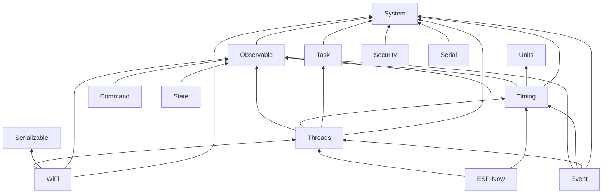

# Dependency Graph

The 1.0.0 platform is intentionally layered. Required dependencies point toward more foundational contracts; optional integrations point downstream only when selected.



This diagram emphasizes the stable core direction. Optional edges include:

```text
Units           - - -> Serializable
Serializable    - - -> Security
Persistence     - - -> Serializable
Persistence     - - -> Security (via protected Serializable integration)
Command         - - -> Event
State           - - -> Threads (coalesced observer layer)
Serial          - - -> Command / Event / State / Timing / Threads / Security / WiFi / ESP-Now
WiFi            - - -> Persistence / Security / Event / Command
ESP-Now         - - -> WiFi / Event / Command / Security / State
```

## Reading the graph

An optional integration is not permission to invert the core dependency. For example, ESP-Now may depend on WiFi coordination when selected, but WiFi does not depend on ESP-Now. Serial may observe State, but State does not depend on Serial.

## Platform providers

Target packages implement contracts rather than becoming foundational dependencies of portable libraries:

```text
ESPressio-ESP32 (target package)
    - - implements -> System providers
    - - implements -> WiFi IWiFiPlatform
    - - provides   -> target byte-stream/storage/etc adapters
```

The ESP32 package is intentionally not part of this visible Wiki baseline while its architecture is still changing; the provider direction shown here is the stable architectural contract that consuming libraries depend upon.

## Avoid dependency inflation

Before adding a dependency, ask whether the integration can live in an optional header or downstream adapter. Foundational libraries should not acquire large domain dependencies solely to expose convenience helpers.